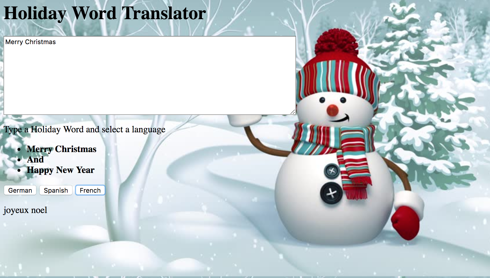

# Language -Translator

### Holiday Language Assignment
This is a Holiday Translator. Type in the Holiday word of Merry Christmas and Happy New Year and see the work translate it in German, Spanish, and French

## Screenshots


## How to run this project


* Use npm to instal http-server : 
``` 
npm install -g http-server

````
* Run the server

``` sh
hs  -p 9999
```
* Open Chrome and navaigate to: 
```
localhost: 8083
```http://127.0.0.1:8083/
``` js


